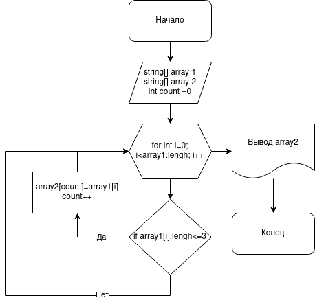

## Итоговая проверочная работа ##

*ЗАДАЧА:*

Написать программу, которая из имеющегося массива строк формирует массив из строк, длина которых меньше либо равна 3 символа. Первоначальный массив можно ввести с клавиатуры, либо задать на старте выполнения алгоритма. При решение не рекомендуется пользоваться коллекциями, лучше обойтись исключительно массивами.

*Алгоритм выполнения задания:*

1. Создать репозиторий на Github
2. Нарисовать блок-схему алгоритма (можно обойтись блок-схемой основной содержательной части, если вы выделяете ее в отдельный метод)
3. Снабдить репозиторий оформленным текстовым описанием решения (файл README.MD)
4. Написать программуб решающую поставленную задачу
5. Использовать контроль версий в работе над этим небольшим проектом (не должно быть так, что все залито одним коммитом, как минимум  этапы 2, 3, 4 должны быть расположены в разных коммитах)

### Задача 2 
*Блок схема задачи представлена в двух вариантах*
* Растровом

* Векторном.  Файл Final_project_001.drawio

### Задача 3
Описание алгоритма решения:
1. Инициализируем два массива одинаковой длины. Результирующий массив будет длиной не более первого.
2. Следующий этап - цикл, который перебирает все элементы массива и проверяет условие длины элемента - не более трех (<=3).
3. Если условие верно, то этот элемент будет добавлен в новый массив.
Счётчик count - счётчик второго массива, который увеличивается при добавлении нового элемента.
Если условие ложно, берем следующий элемент первого массива и так делаем со всеми элементам первого массива.
4. Выводим второй массив.

### Задача 4
Решение алгоритма на языке C# представлено в файле Program.cs

